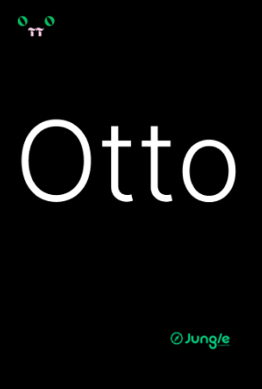
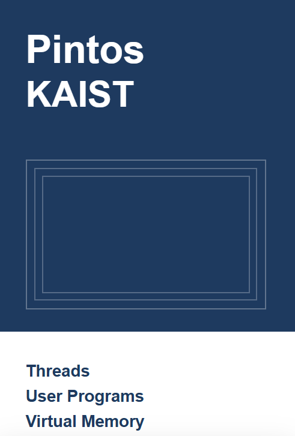
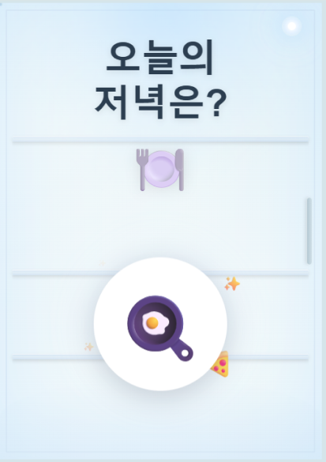

<h1 align="left">👋 Hi there, I'm Minji Ko!</h1>

- 문제를 이해하며 구현하는 경험을 쌓고 있습니다.

- 사용자 친화적인 UI/UX를 만드는 것에 관심이 많으며, 기술과 디자인을 연결하는 개발자로 성장하고 싶습니다.

# 📂Project

  

  

  <!--  -->

  

  <h2 style="border-bottom: 1px solid #d8dee4; color: #282d33;">🛠️ Tech Stacks</h2>
   
  

    
    
    
     
    
     
    
    
      
    
    
    
    
    
    
    
  

  <h2 style="border-bottom: 1px solid #d8dee4; color: #282d33;">🧑‍💻 Blog & Writing</h2>
   
  
    
  

  <h2 style="border-bottom: 1px solid #d8dee4; color: #282d33;">🏅 Stats</h2>
  

    
    
  

---

